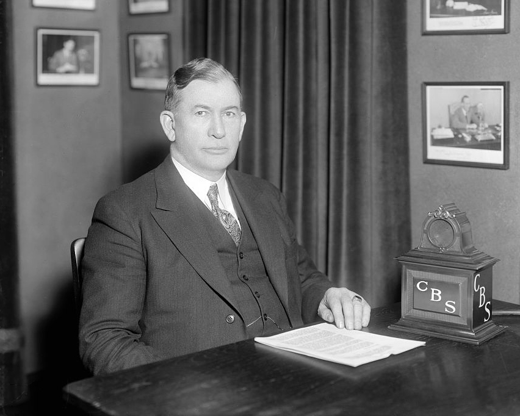

# alben

Experimenting with common lisp, guided by [PAIP](http://norvig.com/paip.html).

## To run

```
> (load "grammar.lisp")
> (generate 'sentence)

```

## What's with the name?

[Alben Barkley](https://en.wikipedia.org/wiki/Alben_W._Barkley) was the 35th Vice President of the United States, from 1949 to 1953.


